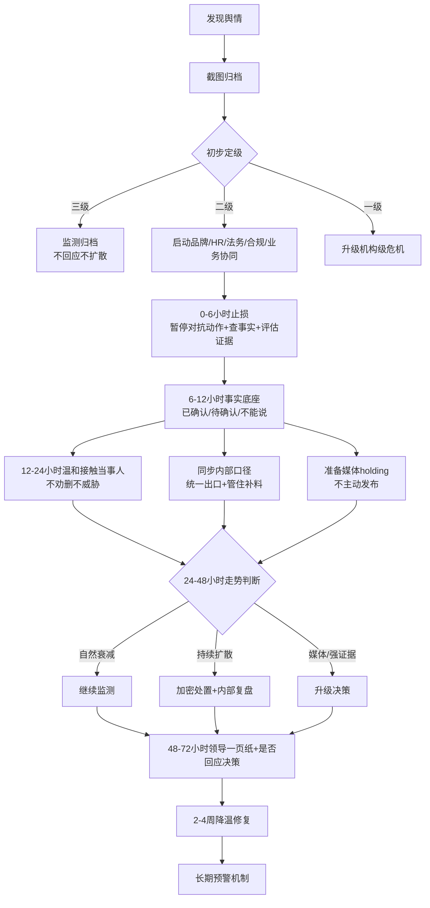
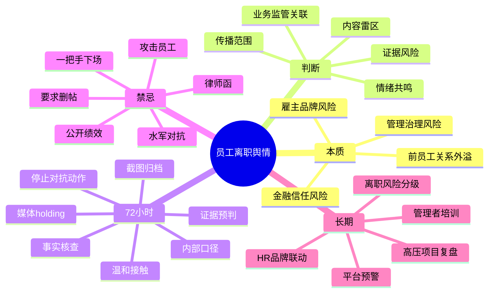

# Employee Exit Employer Brand Crisis Playbook

## Table of Contents

1. Trigger Scenarios
2. Risk Rating
3. 72-Hour SOP
4. Platform Strategy
5. Response Decision Tree
6. Financial Institution Overlay
7. 2-4 Week Repair
8. Long-Term Early Warning
9. Mermaid SOP and Mind Map

## 1. Trigger Scenarios

Use this playbook for:

- Former employee posts on Xiaohongshu, Maimai, Weibo, WeChat Channels, Douyin, LinkedIn, industry groups, or public accounts.
- Complaints about overtime culture, project pressure, management style, performance review, layoffs, resignation process, workplace bullying, discrimination, compensation, or company culture.
- Other former employees or current employees join in comments.
- Workplace posts begin spreading into business, financial, tech, or industry media.
- Regulated financial institutions need restrained PR handling.

## 2. Risk Rating

### Level 3: Monitor

Signals:

- Single platform.
- Low engagement.
- Mostly emotional venting.
- No evidence, no employee relay, no media attention.

Actions:

- Archive screenshots and links.
- Monitor quietly.
- Do not contact, respond, or amplify unless new signals emerge.

### Level 2: Handle

Signals:

- Cross-platform spread.
- Comments form shared workplace grievance.
- Former employees relay similar experiences.
- Industry groups or self-media begin circulating.
- Employee may hold screenshots or recordings.

Actions:

- Start a cross-functional response group.
- Verify facts with HR, business, legal, compliance.
- Stop adversarial comment or suppression actions.
- Prepare employee-contact path and media holding statement.
- Monitor every 2-4 hours.

### Level 1: Institutional Crisis

Signals:

- Mainstream media or major financial/business media follow.
- Strong evidence is released.
- 3 or more employees relay.
- Issue expands to labor dispute, gender, bullying, data security, customer rights, financial compliance, or regulatory concerns.
- Internal employees spread at scale.

Actions:

- Bring in executive decision owner.
- Legal/compliance/HR/brand daily or twice-daily meeting.
- Decide whether public response, third-party mediation, internal investigation, or formal rectification is required.

## 3. 72-Hour SOP

### 0-6 Hours: Stop New Damage

Do:

- Archive original post, high-like comments, reposts, platform links, screenshots, and industry-group circulation.
- Build a crisis group: brand, HR, legal, compliance, business owner, employee relations.
- Pause adversarial comments, visible astroturfing, employee attacks, forced deletion attempts.
- Start fact verification: onboarding, role, project, overtime, attendance, performance, resignation, management communication.
- Assess evidence risk: screenshots, recordings, attendance records, email, performance records, customer/business-sensitive files.

Do not:

- Send legal letter.
- Ask the employee to delete.
- Let direct manager contact the employee.
- Let staff defend the company in comments.
- Publicly discuss employee performance.

### 6-12 Hours: Build the Fact Base

Produce:

- Confirmed / unconfirmed / do-not-say fact table.
- Evidence-risk table.
- Internal Q&A.
- Media holding statement draft.
- Employee contact plan.

Key rule: do not let the direct manager define the full truth alone. Cross-check with HR records, project records, and employee relations context.

### 12-24 Hours: Reduce Reportability

Actions:

- Softly contact the employee through a trusted HR or employee-relations owner.
- Understand the core grievance, desired outcome, and signs of second release.
- Monitor platform spread and media signals.
- Keep the official account silent unless escalation requires otherwise.
- Control internal information supply: no sharing, commenting, “explaining,” or anonymous supplementing.

### 24-48 Hours: Trend Judgment

Classify the trend:

- **Natural decline**: monitor, do not amplify.
- **Sustained spread without hard evidence**: strengthen monitoring, continue internal handling, avoid official statement.
- **Media inquiry**: use holding statement after legal/compliance review.
- **Strong second release or multiple employee relay**: escalate to Level 1.

### 48-72 Hours: Stabilize

Produce:

- One-page leadership report.
- Decision on public response.
- Internal management review plan.
- 2-week repair plan.
- Long-term early-warning owner.

## 4. Platform Strategy

### Xiaohongshu

Risk: emotional resonance and workplace identity. One concrete post can trigger many “same here” comments.

Use:

- Main post low interaction.
- Peripheral dilution through low-key, real, non-boastful employer/professional content.
- Platform complaint only for privacy leaks, defamation, or clear rule violations.

Avoid:

- “Company is great” comments.
- “You are too fragile” comments.
- High-frequency identical wording.

### Maimai

Risk: anonymous employee relay and industry backchannel.

Use:

- Monitor company name, nickname, department, job title, and project terms.
- Watch for “I work here,” “I know this project,” “tip of iceberg.”
- Remind employees not to supplement public information.

Avoid:

- Organizing employees to rebut.
- Public argument with anonymous accounts.

### WeChat Channels / Short Video

Risk: screenshot-to-video transformation and familiar-network spread.

Use:

- Monitor titles using “former employee,” “bank,” “overtime,” “00后,” “project manager.”
- Complaint route for privacy or infringement.

Avoid:

- Official-account comment replies.

### Public Accounts / Financial Media

Risk: transformation into governance story.

Use:

- Prepare media holding statement.
- Do not proactively brief unrelated media.
- If asked, buy time with verification process and response deadline.

## 5. Response Decision Tree

Do not publish if:

- No media inquiry.
- No strong evidence.
- No broad cross-platform naming.
- No material business/compliance expansion.

Prepare holding if:

- Industry groups circulate.
- Self-media begins collecting material.
- Journalist asks for comment.

Escalate response if:

- Strong evidence goes viral.
- Employee says the company pressured them.
- Multiple employees relay.
- Topic touches labor law, discrimination, bullying, customer information, data, or regulatory compliance.

## 6. Financial Institution Overlay

For banks, internet banks, fintechs, and consumer finance companies:

- Treat employer-brand crises as trust-risk issues, not only HR issues.
- Do not imply regulatory endorsement or “compliance proves no problem.”
- Do not discuss customer information, business systems, loan/deposit/product details, or risk control details unless compliance approves.
- If any claim touches consumer rights, data security, product marketing, lending, collection, account safety, or regulatory inspection, escalate immediately.
- Media wording should be short, factual, and privacy-protective.

## 7. 2-4 Week Repair

Goals:

- Let the original post decay.
- Reduce negative search dominance.
- Prevent employee relay.
- Convert external pressure into internal management improvements.

Actions:

- Low-key professional content: fintech project methods, consumer protection, anti-fraud, inclusive finance, real employee growth with authorization.
- Internal review of high-pressure project management, overtime approval, manager communication, resignation interviews.
- HR follow-up with high-risk former employees.

Avoid:

- “Our employees are happy.”
- “We never encourage overtime.”
- “Young people need resilience.”
- Any obvious reputation-washing.

## 8. Long-Term Early Warning

Create a resigning-employee risk table:

- Low: normal resignation, no conflict, no public expression habit.
- Medium: public social account, prior dissatisfaction, high-pressure project.
- High: key role, performance dispute, manager conflict, known grievance.
- Critical: already posted, holds sensitive evidence, multiple employees may join.

Monthly mechanism:

- HR provides medium/high-risk resignation list.
- Brand provides employer-brand public opinion report.
- Legal/compliance reviews labor and regulated-industry sensitivities.

Quarterly mechanism:

- Review high-pressure departments and employee loss causes.
- Train managers on public-expression boundaries.
- Update platform risk rules for Xiaohongshu, Maimai, Weibo, WeChat Channels, and industry communities.

## 9. Mermaid SOP and Mind Map

### Complete SOP

### Mind Map

